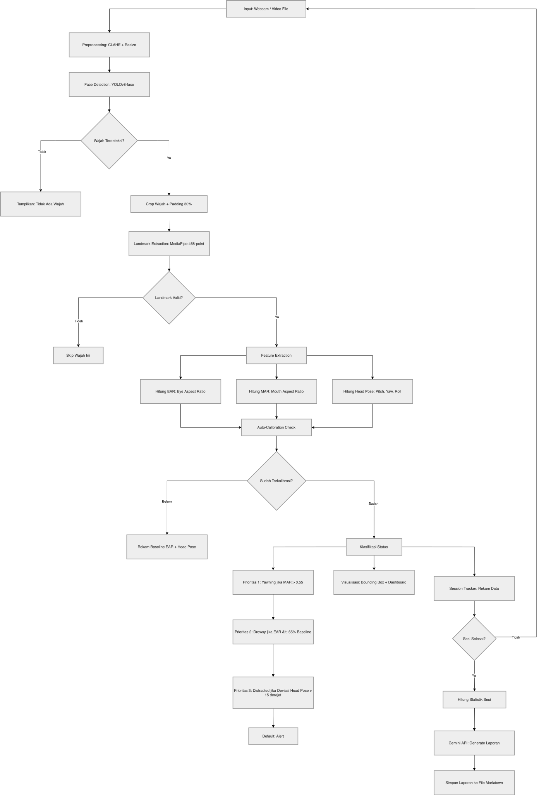

# Student Concentration Monitor

Sistem monitoring konsentrasi mahasiswa di kelas secara real-time menggunakan computer vision dan generative AI. Sistem mendeteksi kondisi kantuk, distraksi, dan menguap melalui analisis wajah, lalu mengklasifikasikan setiap mahasiswa ke dalam empat status konsentrasi: **Alert**, **Drowsy**, **Distracted**, dan **Yawning**.

> Proyek UAS Mata Kuliah TIF24 — Komputer Vision, Universitas Bunda Mulia, Semester Genap 2025/2026.

---

## Daftar Isi

- [Gambaran Umum](#gambaran-umum)
- [Fitur Utama](#fitur-utama)
- [Arsitektur Pipeline](#arsitektur-pipeline)
- [Tech Stack](#tech-stack)
- [Prasyarat](#prasyarat)
- [Instalasi](#instalasi)
- [Konfigurasi](#konfigurasi)
- [Cara Menjalankan](#cara-menjalankan)
- [Struktur Project](#struktur-project)
- [Penjelasan Komponen](#penjelasan-komponen)
- [Keterbatasan](#keterbatasan)
- [Tim Pengembang](#tim-pengembang)

---

## Gambaran Umum

Di ruang kelas konvensional, dosen tidak memiliki cara objektif untuk mengetahui apakah mahasiswanya masih memperhatikan atau sudah kehilangan konsentrasi. Sistem ini menyelesaikan permasalahan tersebut dengan menganalisis wajah mahasiswa melalui webcam atau video file, mengekstrak fitur-fitur visual yang berkorelasi dengan tingkat konsentrasi, dan menampilkan hasil klasifikasi secara real-time dalam bentuk dashboard visual.

Setelah sesi monitoring selesai, sistem dapat menghasilkan laporan analisis konsentrasi kelas secara otomatis menggunakan Google Gemini API dalam bentuk teks naratif berbahasa Indonesia.

---

## Fitur Utama

- **Deteksi wajah real-time** menggunakan YOLOv8-face dengan dukungan multi-face
- **Ekstraksi 468 titik landmark 3D** per wajah menggunakan MediaPipe FaceLandmarker
- **Auto-calibration** yang menyesuaikan threshold secara otomatis terhadap bentuk mata dan posisi kamera setiap individu, menghilangkan bias terhadap variasi fisik antar pengguna
- **Empat status klasifikasi**: Alert (fokus), Drowsy (mengantuk), Distracted (teralihkan), Yawning (menguap)
- **PERCLOS tracking** (Percentage of Eye Closure) untuk deteksi kantuk temporal
- **Dashboard real-time** dengan bounding box berwarna, info panel fitur, dan persentase konsentrasi kelas
- **Weighted concentration** yang bertransisi secara gradual (bukan binary 0/100%)
- **Dual input**: webcam langsung atau file video
- **Laporan AI otomatis** menggunakan Google Gemini API dengan fallback template jika API tidak tersedia

---

## Arsitektur Pipeline



---

## Tech Stack

| Komponen | Teknologi | Keterangan |
|----------|-----------|------------|
| Bahasa | Python 3.12 | via Conda environment |
| Face Detection | YOLOv8-face (Ultralytics) | Model `face_yolov8n.pt` dari Bingsu/adetailer |
| Landmark Extraction | MediaPipe FaceLandmarker | 468 titik landmark 3D, Tasks API |
| Image Processing | OpenCV | CLAHE, resize, rendering, kamera |
| Head Pose | cv2.solvePnP | Perspective-n-Point algorithm |
| Generative AI | Google Gemini 2.0 Flash | Laporan naratif otomatis |
| Environment | python-dotenv | Manajemen API key |

---

## Prasyarat

- **Python 3.12** (disarankan melalui [Miniconda](https://docs.conda.io/en/latest/miniconda.html) atau [Anaconda](https://www.anaconda.com/))
- **Webcam** (untuk mode real-time)
- **Koneksi internet** (untuk download model pada eksekusi pertama dan Gemini API)

---

## Instalasi

### 1. Clone Repository

```bash
git clone https://github.com/username/student-concentration-monitor.git
cd student-concentration-monitor
```

### 2. Buat Conda Environment

```bash
conda create -n student-concentration python=3.12
conda activate student-concentration
```

### 3. Install Dependencies

```bash
pip install -r requirements.txt
```

### 4. Download Model MediaPipe

Download file berikut dan simpan ke folder `models/`:

```
https://storage.googleapis.com/mediapipe-models/face_landmarker/face_landmarker/float16/1/face_landmarker.task
```

**macOS/Linux:**
```bash
cd models
curl -O https://storage.googleapis.com/mediapipe-models/face_landmarker/face_landmarker/float16/1/face_landmarker.task
cd ..
```

**Windows (PowerShell):**
```powershell
cd models
Invoke-WebRequest -Uri "https://storage.googleapis.com/mediapipe-models/face_landmarker/face_landmarker/float16/1/face_landmarker.task" -OutFile "face_landmarker.task"
cd ..
```

Model YOLOv8-face (`face_yolov8n.pt`) akan terdownload otomatis dari HuggingFace saat program pertama kali dijalankan.

---

## Konfigurasi

Buat file `.env` di root folder project berdasarkan template `.env.example`:

```bash
cp .env.example .env
```

Buka `.env` dan masukkan API key Google Gemini:

```
GEMINI_API_KEY=api_key_kamu_di_sini
```

Dapatkan API key gratis di [Google AI Studio](https://aistudio.google.com/app/apikey).

> **Catatan:** Komponen Gemini API bersifat opsional. Jika API key tidak diisi atau koneksi internet tidak tersedia, sistem tetap berfungsi penuh untuk monitoring real-time dan menggunakan laporan template sebagai pengganti laporan AI.

---

## Cara Menjalankan

Pastikan conda environment sudah aktif (`conda activate student-concentration`).

```bash
# Mode webcam (default)
python main.py

# Mode webcam + generate laporan AI setelah sesi selesai
python main.py --report

# Mode video file
python main.py --video path/ke/video.mp4

# Mode video file + laporan AI
python main.py --video path/ke/video.mp4 --report
```

Tekan **Q** pada jendela OpenCV untuk menghentikan program.

### Catatan Eksekusi Pertama

- **macOS**: Sistem operasi akan meminta izin akses kamera. Klik **Allow** pada dialog yang muncul.
- **Windows**: Pastikan webcam tidak sedang digunakan oleh aplikasi lain.
- **Auto-calibration**: Selama ~1 detik pertama, hadapkan wajah ke kamera dalam kondisi normal (mata terbuka, kepala lurus ke depan). Sistem merekam baseline untuk kalibrasi.

---

## Struktur Project

```
student-concentration-monitor/
├── models/
│   ├── .gitkeep
│   ├── face_landmarker.task     # MediaPipe model (download manual)
│   └── face_yolov8n.pt          # YOLOv8-face (auto-download)
├── reports/                     # Output laporan AI (auto-generated)
├── src/
│   ├── __init__.py
│   ├── preprocessing.py         # CLAHE, resize, denoise
│   ├── detection.py             # YOLOv8 face detection + cropping
│   ├── landmarks.py             # MediaPipe 468-point landmark extraction
│   ├── features.py              # EAR, MAR, head pose estimation
│   ├── classifier.py            # Auto-calibration + klasifikasi 4 status
│   ├── report.py                # Session tracking + Gemini API report
│   └── visualizer.py            # OpenCV rendering (bbox, panel, dashboard)
├── main.py                      # Entry point + pipeline orchestration
├── requirements.txt
├── .env.example                 # Template konfigurasi API key
└── README.md
```

---

## Penjelasan Komponen

### Preprocessing (`preprocessing.py`)

Menerapkan CLAHE (Contrast Limited Adaptive Histogram Equalization) pada channel lightness di color space CIELAB untuk menyeragamkan kontras frame. Frame juga di-resize ke maksimum 1280px untuk menjaga kecepatan pemrosesan.

### Face Detection (`detection.py`)

Menggunakan YOLOv8-face (varian nano, ~6MB) untuk mendeteksi wajah. Setiap wajah yang terdeteksi di-crop dengan padding 30% agar MediaPipe mendapatkan konteks visual yang cukup di sekitar area wajah.

### Landmark Extraction (`landmarks.py`)

MediaPipe FaceLandmarker mengekstrak 468 titik landmark 3D per wajah. Pemrosesan dilakukan per-crop (bukan full-frame) untuk akurasi yang lebih tinggi pada skenario multi-face. Koordinat landmark ditranslasi kembali ke ruang frame asli menggunakan offset crop.

### Feature Extraction (`features.py`)

Menghitung tiga kelompok fitur dari landmark:
- **Eye Aspect Ratio (EAR)**: rasio keterbukaan mata, rata-rata dari kedua mata
- **Mouth Aspect Ratio (MAR)**: rasio keterbukaan mulut untuk deteksi menguap
- **Head Pose (pitch, yaw, roll)**: orientasi kepala via algoritma solvePnP

### Classifier (`classifier.py`)

Melakukan auto-calibration selama ~1 detik pertama untuk merekam:
- Baseline EAR (persentil ke-75, robust terhadap kedipan)
- Baseline pitch dan yaw kepala

Klasifikasi menggunakan logika prioritas:
1. **Yawning** — MAR > 0.55
2. **Drowsy** — EAR < 65% baseline ATAU PERCLOS > 40%
3. **Distracted** — deviasi pitch/yaw > 15° dari baseline
4. **Alert** — tidak ada kondisi di atas yang terpenuhi

### Visualizer (`visualizer.py`)

Merender bounding box berwarna sesuai status (hijau/kuning/oranye/merah), state label, info panel fitur (auto-hide jika wajah > 3), dan dashboard agregat dengan persentase konsentrasi kelas yang bertransisi secara gradual.

### Report Generator (`report.py`)

Mengumpulkan statistik sesi (distribusi status, timeline snapshot setiap 5 detik) dan mengirimnya ke Gemini 2.0 Flash untuk menghasilkan laporan naratif. Laporan disimpan sebagai file Markdown di folder `reports/`.

---

## Keterbatasan

- **Tidak ada persistent face tracking.** Identitas wajah tidak dipertahankan antar frame. PERCLOS dihitung secara agregat, bukan per individu.
- **Auto-calibration mengasumsikan posisi normal.** Subjek harus menghadap kamera dengan mata terbuka dan kepala lurus selama satu detik pertama.
- **Belum divalidasi pada skala kelas besar.** Pengujian dilakukan pada 1-3 wajah. Performa pada puluhan wajah simultan belum terukur.
- **Sensitivitas terhadap kualitas kamera.** Webcam dengan resolusi rendah atau frame rate rendah dapat menurunkan akurasi deteksi landmark.

---

## Tim Pengembang

| Nama | Peran |
|------|-------|
| — | Preprocessing dan Pipeline Integration |
| — | Feature Extraction (EAR, MAR, Head Pose) |
| — | Klasifikasi, Visualisasi dan Generative AI Report |

Kelompok 2 — TIF24 Komputer Vision, Universitas Bunda Mulia.
